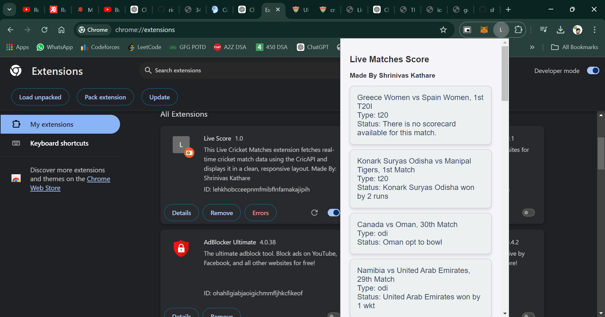

# Live Cricket Matches Extension

This extension fetches real-time cricket match data using the CricAPI and dynamically displays it in a responsive and easy-to-read format. Users can view ongoing match details, including the match name, type, and current status, all in a clean list format.

## Example Screenshot


## Features

- Fetches live cricket match data from CricAPI.
- Displays match name in **bold**, along with the match type and current status on separate lines.
- Responsive design with hover effects for better user interaction.
- Mobile-friendly layout that adapts to smaller screen sizes.

## Installation

1. Clone this repository or download the source code.
2. Place the HTML, CSS, and JavaScript files in the same directory.
3. Make sure you have a valid CricAPI API key to replace the placeholder in the script.

## How to Use

1. Replace the `APIKEY` in the `script.js` file with your CricAPI key:
   ```javascript
   const response = await fetch("https://api.cricapi.com/v1/currentMatches?apikey=YOUR_API_KEY&offset=0");
   ```

2. Open the `index.html` file in your browser to see live cricket match data displayed dynamically.

## Dependencies

- [CricAPI](https://cricapi.com/) for live match data.

## License

This project is licensed under the MIT License. Feel free to use and modify it as per your needs.
